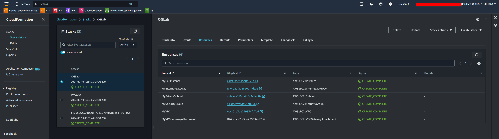

# AWS-CloudFormation-to-create-an-AWS-VPC-and-Amazon-EC2-instance

This is a CloudFormation template that creates a VPC, internet gateway, private subnet, security group, and an EC2 instance in AWS.

## Parameters

### `LabVpcCidr`

- Type: String
- Default: `192.168.0.0/24`
- Description: The CIDR block for the VPC

### `PrivateSubnetCidr`

- Type: String
- Default: `192.168.0.128/27`
- Description: The CIDR block for the private subnet

### `AmazonLinuxAMIID`

- Type: `AWS::SSM::Parameter::Value<AWS::EC2::Image::Id>`
- Default: `/aws/service/ami-amazon-linux-latest/amzn2-ami-hvm-x86_64-gp2`
- Description: The ID of the Amazon Linux image to use for the EC2 instance

## Resources Created

- A VPC with the specified CIDR block
- An internet gateway attached to the VPC
- A private subnet within the VPC with the specified CIDR block
- A security group that allows SSH from anywhere
- An EC2 instance with the specified image and instance type, launched in the private subnet

## Usage

1. Create a new CloudFormation stack in AWS and upload this template file.
2. Fill in the required parameters (e.g. `LabVpcCidr`, `PrivateSubnetCidr`, and `AmazonLinuxAMIID`).
3. Click "Create stack" to create the resources.
4. Wait for the stack to complete (this may take a few minutes).
5. Once the stack is complete, you can access the EC2 instance using SSH and the public IP address of the instance.

## Note

This template is for lab and testing purposes only. Make sure to modify the template to fit your specific needs and security requirements before using it in production.

## License

This template is licensed under the MIT License. See the LICENSE file for more information.
